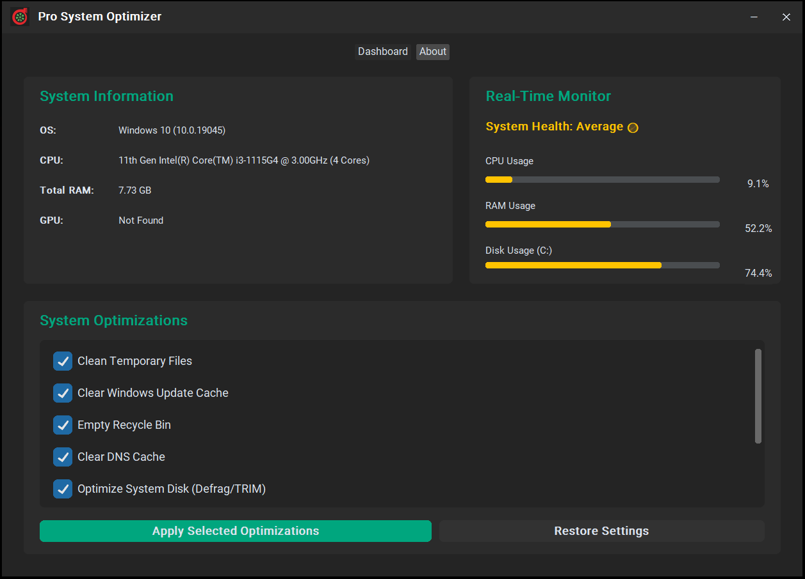

# 🧼 Pro System Optimizer

**Pro System Optimizer** is a Windows-based desktop application developed using Python and CustomTkinter.  
It allows users to monitor system health and apply performance-boosting optimizations like cleaning temp files, adjusting power plans, disabling background apps, and more.

---



---

## ✨ Features

- 🔍 **Real-Time Monitoring:**
  - CPU, RAM, and Disk usage display
  - Visual health status indicator

- 🧹 **Optimization Tools:**
  - Clean temporary files
  - Empty Recycle Bin
  - Clear DNS & Windows Update cache
  - Defrag / TRIM system drive
  - Apply high-performance power plan
  - Disable background apps
  - Adjust visual effects

- 📊 **System Info Panel:**
  - Detects OS, CPU, RAM, and GPU details

- 💾 **Restore Settings:**
  - Safely revert to previous system settings using backup

---
---

## ⚠️ Important

**This tool requires Administrator privileges to work correctly.**

### How to run as Administrator on Windows:

1. Locate the `ui_main.py` file in File Explorer.
2. Right-click on the file.
3. Select **Run with PowerShell** or open a terminal as Administrator.
4. Alternatively, open **Command Prompt** or **PowerShell** as Administrator:
   - Click **Start** > type `cmd` or `powershell`
   - Right-click the app and select **Run as administrator**
5. Navigate to the project folder and run:


## 🚀 How to Run

### 🔧 Requirements

Install dependencies using:

```bash
pip install -r requirements.txt

python main.py

